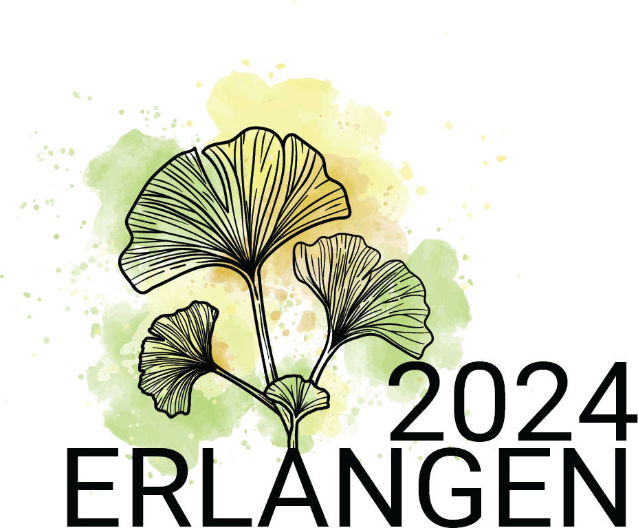
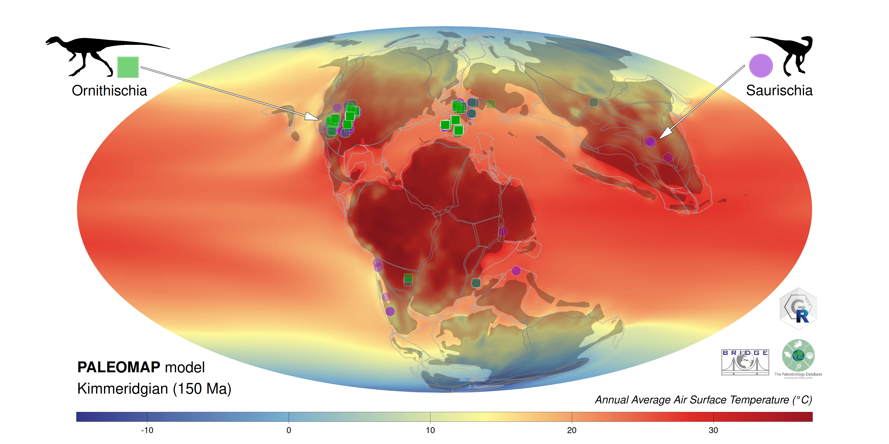

# Deep-time Paleogeography in R 

Material for the workshop at the 2024 PalAss Annual Meeting in Erlangen

## Depedendencies

The material here is dependent on the following software (and their dependencies):

- GPlates Desktop Application (v2.5.0)
- GPlates Web Service (v0.2.0)
- R (v4.4.2), with extensions:
  - rgplates (v0.5.0)
  - terra
  - via
  
## Instructions 
 
1. Clone the repository or download it as a zip file and extract it.
2. Examples are in the `code` directory, and they are numbered.
  - `1_explore.R`: Exploring plate tectonic models with `rgplates`
  - `2_pointData.R`: Using point spatial data with tectonic models.
  - `3_reconstruction_products.R`: Examples showing how to approach paleogeographic reconstructions that are based on specific tectonic reconstructions.
3. After the last tutorial script, you are welcome to check out the code that is used to create this demonstration figure ([here](https://gplates.github.io/rgplates/#using-reconstructions)):

Additional tutorials can be found on the [website of `rgplates` package](https://gplates.github.io/rgplates).
